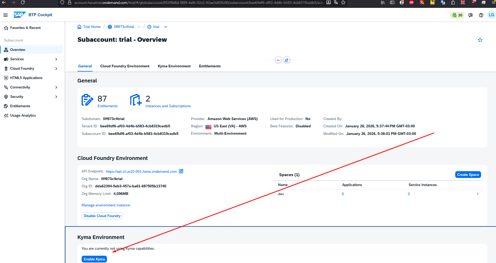
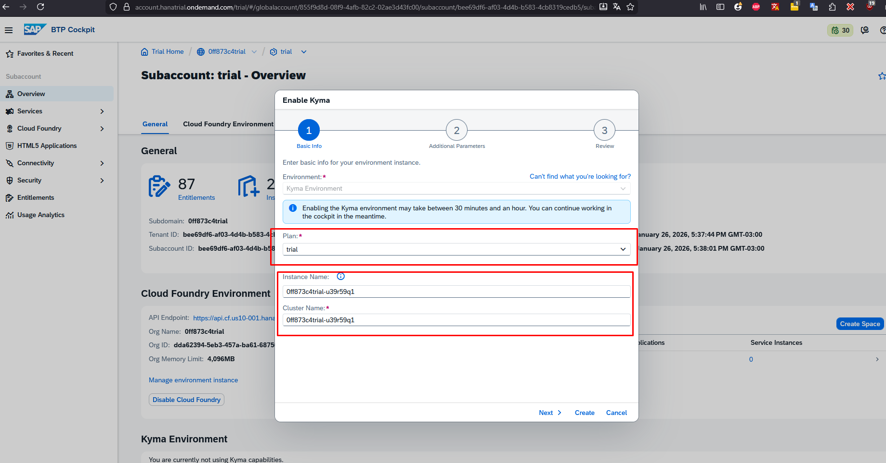
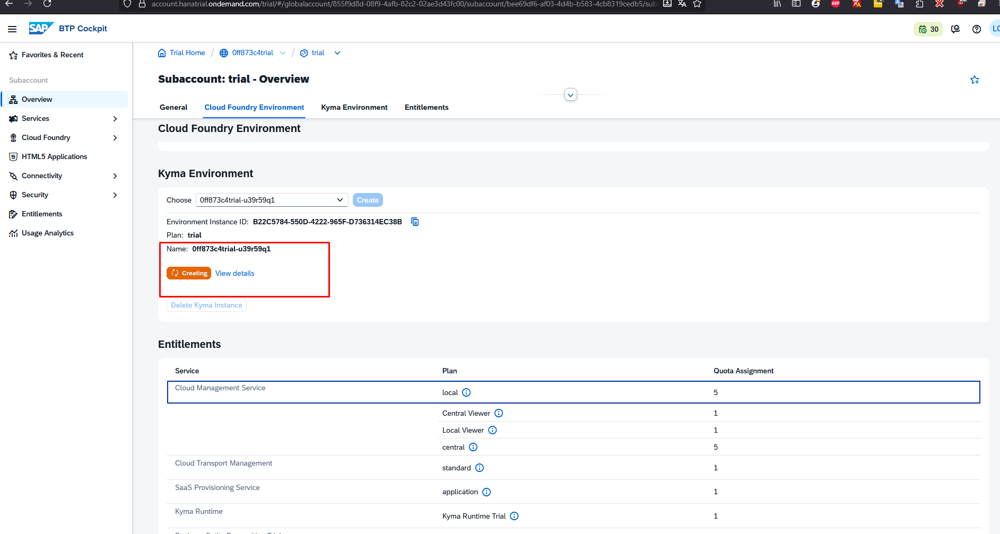

# Link para o trial da SAP: https://cockpit.hanatrial.ondemand.com/trial/
# passo 1: criar um cluster

# passo 2: escolher parametros

# passo 3: criando o cluster

### SAP KYMA RUNTIME XP
- SUBACCOUNT: https://ahig3ghv4.accounts.ondemand.com/oauth2/authorize?response_type=code&scope=openid+email+profile&redirect_uri=https%3A%2F%2Femea.cockpit.btp.cloud.sap%2Flogin%2Fcallback&client_id=306ee77d-68d9-4398-ac62-1d07872563f9&state=ypYcuTNJcWHN959FV41DMg&code_challenge=7kgmsnlbePmnufhDU_-ErwuETEG7cYSGgHOxxs8imFE&code_challenge_method=S256

#### USUARIOS ESTAO DISPONIVEIS NO COMPARTILHAMENTO DE TELA DA APRESENTACAO