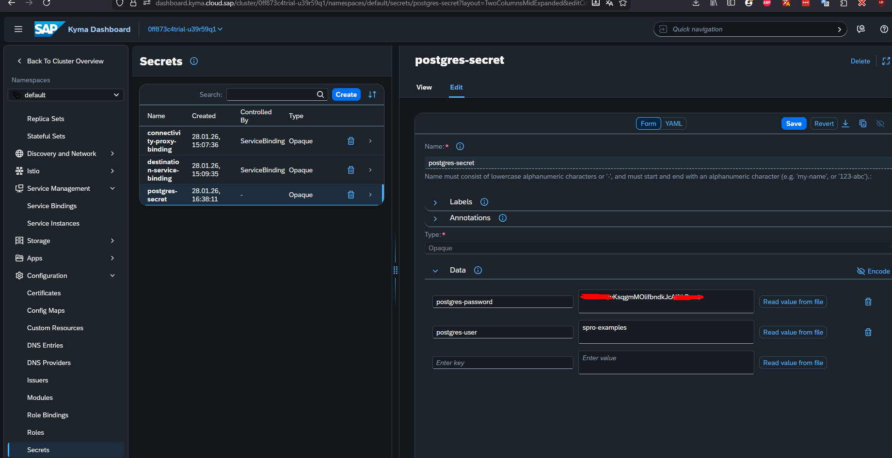

# criar namespace
nome: utilize o usuario, substitua . por -. exemplo: luiz-gomes
`kubectl --kubeconfig="<caminho-kubeconfig-file>" create namespace <nome-namespace>`

# habilitar sidercar
`kubectl --kubeconfig="<caminho-kubeconfig-file>" label namespaces <nome-namespace> istio-injection=enabled`

## via dashboard
- acesse o namespace criado
- navegue ate o menu Configuration>Secrets
- crie a secrect

nome: postgres-secret
postgres-user: <a senha esta disponivel no chat do evento>
postgres-password: <a senha esta disponivel no chat do evento>

