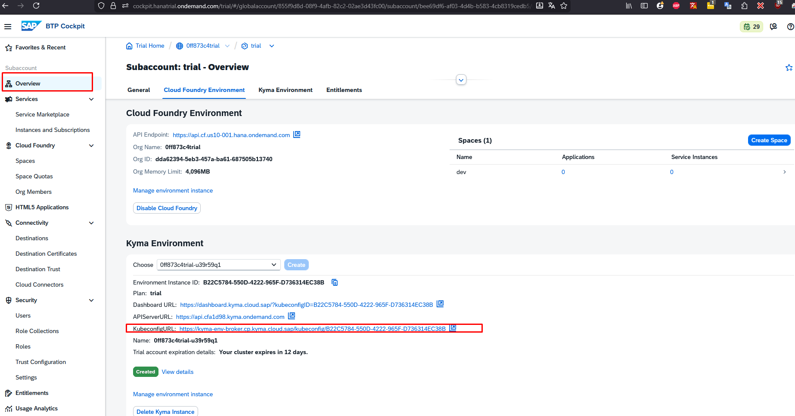
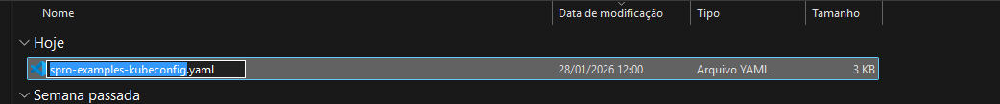
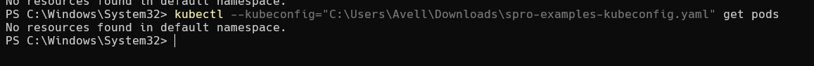

# Obter arquivo kubeconfig
- baixar arquivo kubeconfig

- renomear arquivo kubeconfig para spro-examples-kubeconfig.yaml

# Instalar okubectl
- kubectl cli https://kubernetes.io/pt-br/docs/tasks/tools/install-kubectl-windows/
- kubectl login: choco install kubelogin (windows)

## Teste de conexão
- kubectl --kubeconfig="<caminho-para-o-arquivo>\spro-examples-kubeconfig.yaml"
- login

- listar pods no namespace default
