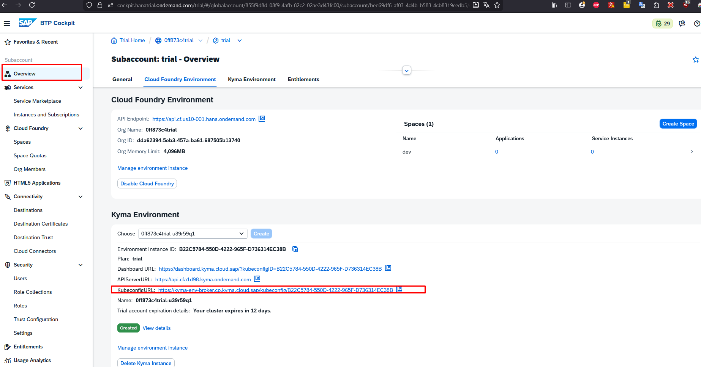
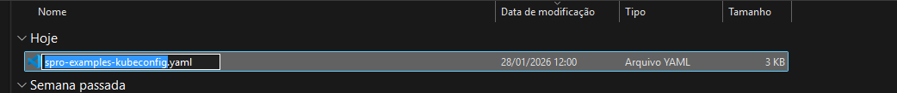
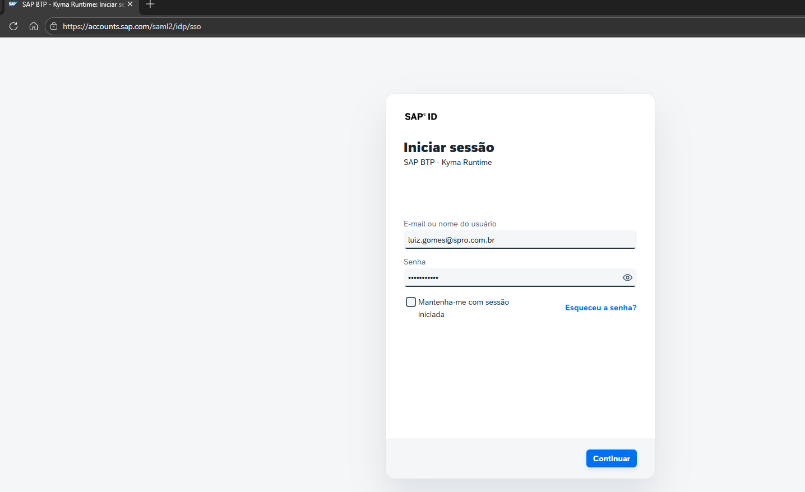
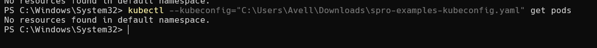

# Obter arquivo kubeconfig
- baixar arquivo kubeconfig

- renomear arquivo kubeconfig para spro-examples-kubeconfig.yaml


# Instalar okubectl
- kubectl cli https://kubernetes.io/pt-br/docs/tasks/tools/install-kubectl-windows/
- kubectl login: choco install kubelogin (windows)

## Teste de conexão
- kubectl --kubeconfig="<caminho-para-o-arquivo>\spro-examples-kubeconfig.yaml"
- login

- listar pods no namespace default



```
curl -LO https://github.com/int128/kubelogin/releases/latest/download/kubelogin_linux_amd64.zip
unzip kubelogin_linux_amd64.zip
chmod +x kubelogin
sudo mv kubelogin /usr/local/bin/kubectl-oidc_login


```
