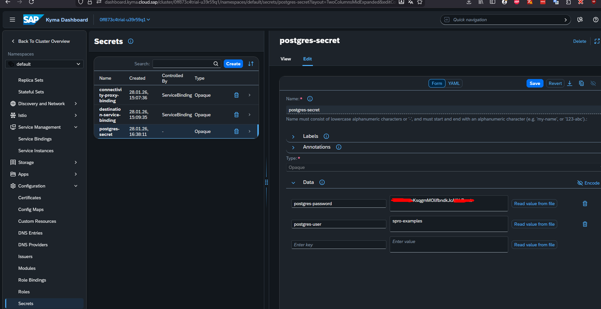

## via dashboard
- acesse o namespace default
- naveggue ate o menu Configuration>Secrets
- crie a secrect

nome: postgres-secret
postgres-user: btpexperience2026
postgres-password: <sera disponibilizada durante o evento>

