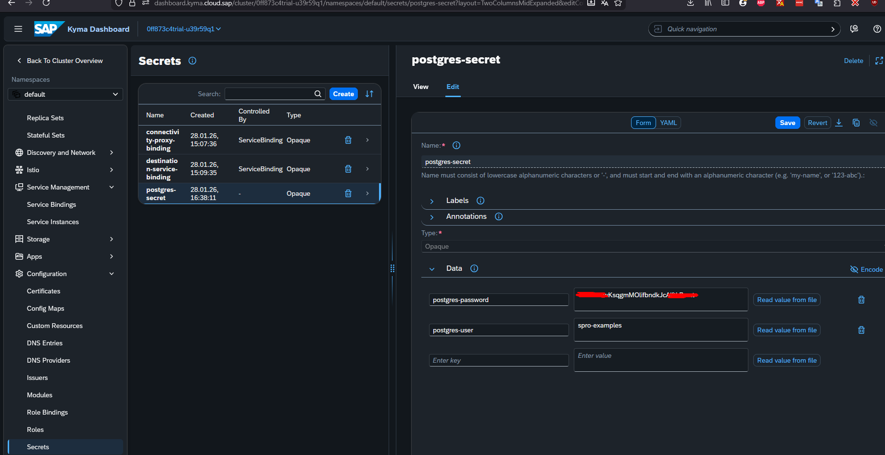

# habilitar sidercar
`kubectl --kubeconfig="<caminho-kubeconfig-file>" label namespaces default istio-injection=enabled`

# statefulset postgres
Como vamos armazenar os dados do Postgres no cluster, vamos utilizar o StatefulSet. O StatefulSet é um recurso que permite que você crie e gerencie conjuntos de Pods com os mesmos dados, sempre mantendo o estado de todos os Pods em um único nó.

# volumes
Os volumes são usados para armazenar dados persistentes. Os volumes são criados e armazenados no armazenamento local do cluster.

# apply 
- cd .\03-postgres\
- criar volume
`kubectl --kubeconfig="<caminho-para-o-arquivo>\spro-examples-kubeconfig.yaml" apply -f postgres-persistent-volume.yaml`


- criar statefulset
`kubectl --kubeconfig="<caminho-para-o-arquivo>\spro-examples-kubeconfig.yaml" apply -f postgres-16.3.yaml`


- criar secrets: postgres-secret
via dashboard



# resultado


# Descrição
## sidercar
O Istio sidecar controla o tráfego, segurança e observabilidade de um aplicativo. Dessa forma não ocorre uma comunicação dreta ao pod.
## volumes
Os volumes são usados para armazenar dados persistentes.
o link entre o pod do postgres e o volume é feito nesse trecho do arquivo postgres-16.3.yaml
```
      volumeMounts:
            - name: postgresdb
              mountPath: /data
         
      volumes:
        - name: postgresdb
          persistentVolumeClaim:
            claimName: postgres-data-pvc 
```
Esse trecho é usado como  referencia para uso do volume
```
 name: postgres-data-pvc
```
Esse trecho permite a implantação para leitura e escrita por um único nó do cluster.
```
accessModes: ["ReadWriteOnce"]
```

Esse trecho determina o tamanho do volume, no caso de 20GB.
```
  resources:
    requests:
      storage: 20Gi
```
## serviço
Cria um endpoint interno para o postgres