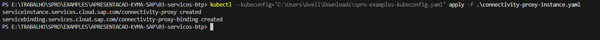
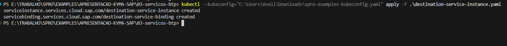
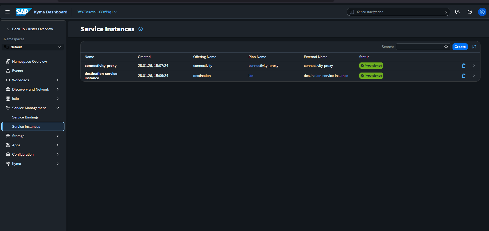

# connectivity-proxy
O serviço connectivity-proxy realiza a conexão do cluster com o Promise(S4/ECC) via Cloud Connector. parecido com o serviço connectivity do BTP.

# destination
o Serviço destination é responsável por fornecer o acesso ao repositório de destinations do SAP BTP.

# apply
Criar os serviços no cluster
- cd .\03-servicos-btp\
- kubectl --kubeconfig="<caminho-para-o-arquivo>\spro-examples-kubeconfig.yaml" apply -f connectivity-proxy-instance.yaml

- kubectl --kubeconfig="<caminho-para-o-arquivo>\spro-examples-kubeconfig.yaml" apply -f destination-service-instance.yaml

# Resultado
