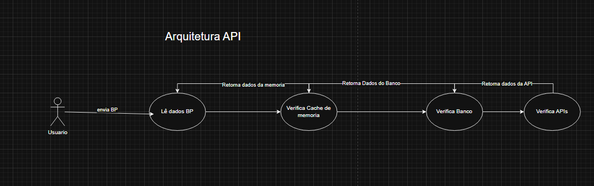
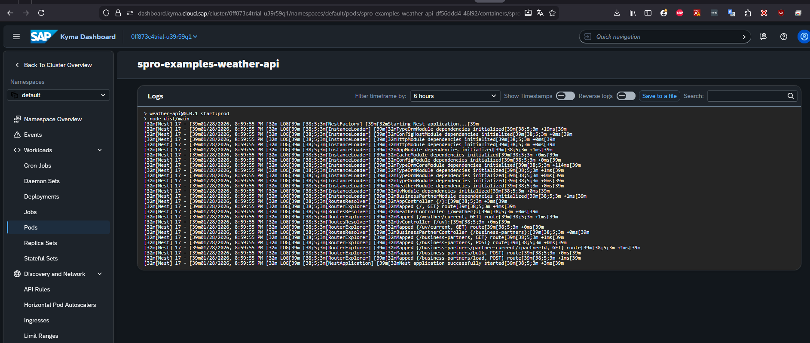

# API


# Publicar imagem no Docker hub
- docker login
- docker compose -f docker-compose-prd.yml build app
- docker compose -f docker-compose-prd.yml push app
- repo docker hub https://hub.docker.com/repository/docker/luizcarlospedrosogomes/weather-api (publico)

# K8S
## Implementar a API no cluster
- cd .\04-api\weather-api\k8s

- deployment
`kubectl --kubeconfig="<caminho-para-o-arquivo>\spro-examples-kubeconfig.yaml" apply -f 01-deployment.yaml`

- serviço
`kubectl --kubeconfig="<caminho-para-o-arquivo>\spro-examples-kubeconfig.yaml" apply -f 02-service.yaml`

- api-rule
`kubectl --kubeconfig="<caminho-para-o-arquivo>\spro-examples-kubeconfig.yaml" apply -f 03-api-rule.yaml`

- criar configmap spro-examples-weather-envs
via dashboard


- hpa
`kubectl --kubeconfig="<caminho-para-o-arquivo>\spro-examples-kubeconfig.yaml" apply -f 05-hpa.yaml`

- criar banco de dados
`kubectl --kubeconfig="<caminho-para-o-arquivo>\spro-examples-kubeconfig.yaml" exec -it -it postgres-0  -- psql  -U spro-examples -c 'CREATE DATABASE "spro-examples-weather";'`
- listar tabelas
`kubectl --kubeconfig="<caminho-para-o-arquivo>\spro-examples-kubeconfig.yaml" exec -it -it postgres-0  -- psql  -U spro-examples -d "spro-examples-weather" -c '\dt'`
## Resultado
API em execução


# Definições
## imagem
    Nesse cenario, a imagem do container é armazenada no Docker Hub. Como é uma imagem publica não é preciso autenticar. Dessa forma omitimos a entrada imagePullSecrets. Para cenarios aonde é imagem é privada, é necessário criar uma secret para autenticar.
## Bindings
    O Binding de serviços é feito de uma forma diferente do que é feito no BTP.

    ``` 
        env:         
          - name: SERVICE_BINDING_ROOT
            value: /bindings
        ...
        volumeMounts:
            - name: spro-examples-weather-xsuaa
              mountPath: "/etc/secrets/sapcp/xsuaa/spro-examples-weather-xsuaa"
              readOnly: true

            - name: destination-volume
              mountPath: /etc/secrets/sapcp/destination/destination-service-instance
              readOnly: true

    ```
    https://community.sap.com/t5/technology-blog-posts-by-sap/power-of-serverless-with-sap-btp-kyma-runtime-secrets-mounted-as-volumes/ba-p/13556560
## HPA
 o Horizontal Pod Autoscaler (HPA) é um recurso do Kubernetes que permite que você ajuste automaticamente a quantidade de podes de um recurso de Kubernetes, como um deployment, para atender às necessidades de carga de trabalho.
-   https://learning.sap.com/courses/developing-applications-in-sap-btp-kyma-runtime/working-with-horizontal-pod-autoscalers-hpa-_cc237556-bfd3-429c-9a0c-0ba57a5377dc

## API Rule
APIRule é o recurso que permite a exposição de um serviço para o mundo externo.