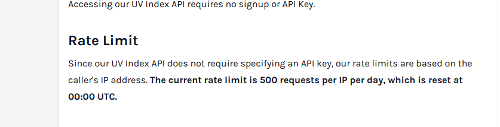

# UV: 
https://currentuvindex.com/api

## dados: https://currentuvindex.com/api/v1/uvi?latitude=40.6943&longitude=-73.9249

# weather: 
https://open-meteo.com/

## dados: https://api.open-meteo.com/v1/forecast?latitude=46.9481&longitude=7.4474&current=temperature_2m,relative_humidity_2m,rain,weather_code