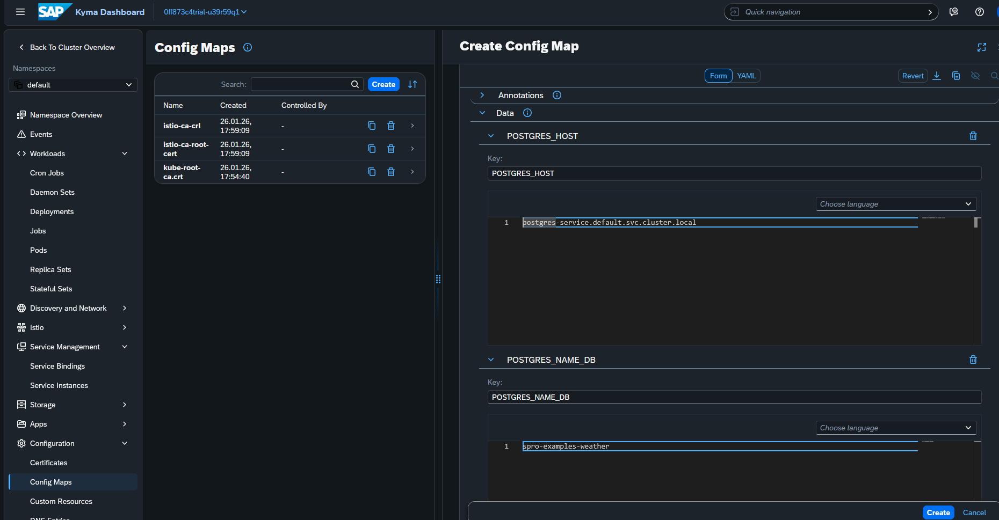

# API

# Publicar imagem no Docker hub
- docker login
- docker compose -f docker-compose-prd.yml build app
- docker compose -f docker-compose-prd.yml push app
- repo docker hub https://hub.docker.com/repository/docker/luizcarlospedrosogomes/weather-api (publico)

# K8S
## Implementar a API no cluster
- cd .\05-api\weather-api\k8s
- deployment
`kubectl --kubeconfig="<caminho-para-o-arquivo>\spro-examples-kubeconfig.yaml" apply -f 01-deployment.yaml`
- serviço
`kubectl --kubeconfig="<caminho-para-o-arquivo>\spro-examples-kubeconfig.yaml" apply -f 02-service.yaml`
- api-rule
`kubectl --kubeconfig="<caminho-para-o-arquivo>\spro-examples-kubeconfig.yaml" apply -f 03-api-rule.yaml`
- criar configmap spro-examples-weather-envs
via dashboard

- criar banco de dados
`kubectl --kubeconfig="<caminho-para-o-arquivo>\spro-examples-kubeconfig.yaml" exec -it -it postgres-0  -- psql  -U spro-examples -c 'CREATE DATABASE "spro-examples-weather";'`
- listar tabelas
`kubectl --kubeconfig="<caminho-para-o-arquivo>\spro-examples-kubeconfig.yaml" exec -it -it postgres-0  -- psql  -U spro-examples -d "spro-examples-weather" -c '\dt'`
## Resultado
API em execução

# Definições
## Bindings
## Replicas
## API Rule
