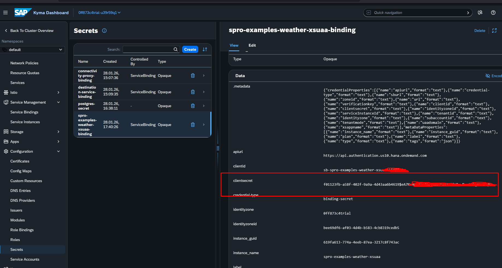

# pacote NPM
- npm i autocannon -g

# variaives de ambiente
- crie um arquivo `.env` com as variaveis: 
```
BTP-USER=<usuario-de-login-do-btp>
BTP-PASSWORD=<senha-de-logindo-btp>
USER-XSUAA='<usuario-de-login-do-xsuaa>'
PASS-XSUAA='<senha-de-login-do-xsuaa>'
```

## obter usuario-de-login-do-xsuaa
- acesse a secret do xsuaa no dashboard

- copie o valor de clientid para USER-XSUAA


## obter senha-de-login-do-xsuaa
- acesse a secret do xsuaa no dashboard

- copie o valor de clientsecret para PASS-XSUAA

# gerar token
 - utilize o arquivo http/gerar-token.http
   - copie o valor da propriedade `access_token` para exportar para variável de ambiente

# Exportar token para variável de ambiente
- bash: `set TOKEN=<valor-de-access_token>`
- powershewl: ` $env:TOKEN="<valor-de-access_token>"`

# teste de carga simples
autocannon --renderStatusCodes -c 5 -d 30 -H "Authorization=Bearer $env:TOKEN" https://spro-examples-weather-api.cfa1d98.kyma.ondemand.com/business-partners/partner-current/C001

# teste de cargapara escalar
autocannon --renderStatusCodes -c 150 -d 120 -H "Authorization=Bearer $env:TOKEN" https://spro-examples-weather-api.cfa1d98.kyma.ondemand.com/business-partners/partner-current/C001

# resultado esperado
