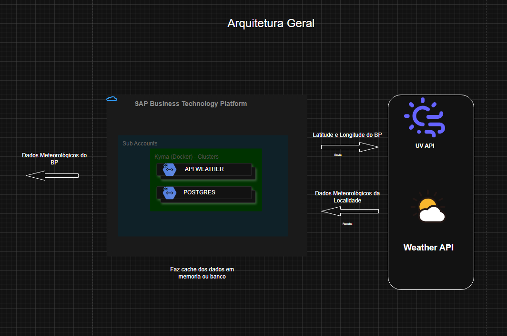

# SAP Kyma Runtime – consumption of external APIs

Vamos explorar na prática o SAP Kyma Runtime e a criação e implantação de objetos do Kubernetes. Ao longo desse processo, demonstraremos como utilizar os recursos do Kyma para simplificar o ciclo de vida da aplicação, acelerar a implantação, garantir escalabilidade e facilitar as operações contínuas em ambientes produtivos.

## Roterio 
- Habibilitar Instancia do Kyma 
- Criar statefullset do postrgresql
- Implantar statefullset do postrgresql
- Criar secrect do postgresql(dashboard Kyma)
- Criar deployment da API(arquivo)
- Implantar deployment da API(comando)
- Criar secrects para a API(dashboard Kyma)
- Criar HPA da API(arquivo)
- Realizar carga de tráfego para a API(comando)

## Arquitetura da solução

## Pods Escaldos

## Pontos de atenção
- instalação o kubectl